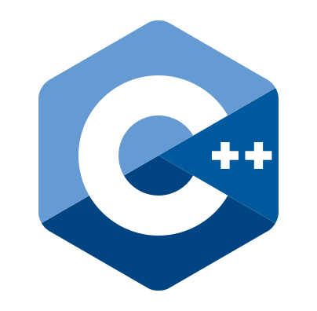

    
    top header a deep fork from https://github.com/amir9480/amir9480

<h2 align="center">Technologies & Languages I use</h2>

    
    
    
    
    
    
    
    

<h2 align="center">me on Social Network</h2>

    
    
    
    
    

<!-- <h2 align="center">my project</h2> -->
